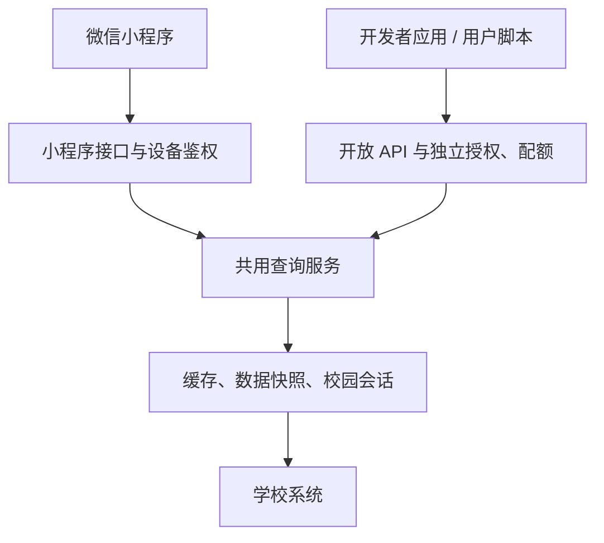

# Lazy Campus 开放平台

<p align="center"></p>

Logo 使用质量 0.9 的 WebP，保留原始尺寸；浏览器圆形图标使用 96px WebP 嵌入 SVG，仓库不保留 PNG 副本。

面向学校用户的免费校园 API 平台。登录后创建应用、选择接口权限，即可在自己的服务或脚本中读取本人校园数据。

- 平台：https://platform.lazycampus.com
- 源码：https://github.com/Gradient-Clipping/lazycampus-platform
- 生产配置：https://github.com/Gradient-Clipping/server-gitops
- 在线接口文档：平台「接口文档」页面；机器可读契约：`/openapi.json`

## 功能

- **统一身份**：仅使用 Keycloak SSO；有会话时自动进入，无会话时自动转到学校登录。没有平台密码登录、注册或登录按钮。
- **身份限制**：学校用户必须具有 Keycloak 签发的 `identity_id` 和 `student_number`。管理员只接受已有的 `ystemsrx`，且必须具有 `platform-admin` 角色。管理员不会自动获得任何学生的数据。
- **开发者应用**：默认最多 10 个应用，独立密钥、接口权限、IP/CIDR 白名单、固定或长期有效期、每日及总调用额度；支持编辑、停用、轮换和删除。管理员可检索所有用户应用，单独暂停、恢复或永久撤销授权，并给出原因。用户不能自行解除管理员暂停或恢复已撤销授权。
- **运营与用量分析**：个人与全站看板，支持时间、用户、应用、接口和请求状态筛选；展示调用量、接纳量、错误率、平均/P95 耗时、服务错误与限流数量。小时/日趋势图、分组排行和日志跳转共用同一筛选口径。
- **调用日志**：支持时间范围、用户/应用、接口、状态、错误码、请求编号、上游请求编号及耗时筛选。详情包含错误原因、来源 IP、是否计入额度、关联用户和应用。已删除应用的历史日志仍保留。
- **运行时配置**：管理员可调整全站默认每日额度、每分钟速率、新应用总额度/有效期/数量、突发和并发上限；账户可选择跟随默认或单独限制。校园接口可配置启停、维护/降级状态、权限范围、说明和每用户限制。更改直接生效，不需要重新部署，不清空已有用量。
- **站点与内容**：品牌、Logo 资源路径、简介、帮助链接、联系邮箱、FAQ、系统公告和公开服务状态页面。内容设置带并发修改检查；身份信息和登录方式仍由 Keycloak 管理。
- **个人告警**：额度阈值、近 15 分钟错误率、限流和应用到期提醒；支持站内与 Sender 事务邮件。个人中心的「通知偏好」可设置邮箱、验证邮箱归属、选择通知渠道与阈值。没有验证邮箱时不能开启邮件通知。站内未读状态跨设备同步。
- **会话管理**：查看平台登录设备、IP、登录和最近活动时间，退出某设备或其他设备；平台会话立即失效，并退出对应 Keycloak 会话。会话刷新不能复活已撤销的设备授权。
- **首页与个人中心**：公开首页提供接入示例和公告；进入控制台自动完成 SSO。个人中心包含身份信息、用量、界面偏好和可自定义的侧边栏。
- **系统公告**：顶栏铃铛提供未读提醒、通知和时间线；管理员可发布、撤下公告，展示最近 50 条。原有公告自动保留，内容以纯文本呈现。
- **界面**：响应式控制台、浅色/深色主题、中英文切换；默认中文，使用本仓库 logo.webp 并以圆形展示（含浏览器图标）。首页顶栏随滚动收缩，侧栏平滑折叠为图标栏，示例代码提供浅色/深色语法高亮；尊重系统减少动态效果设置。界面偏好保存在当前浏览器，侧边栏与公告已读状态按账号区分。

没有支付、充值、订阅、余额、价格、汇率、模型倍率、推理 Token 计费或大模型中转功能。所有额度均以「一次请求」为单位，不涉及金额计算。

## 与 new-api 通用能力的对应关系

对照上游 [bdef117](https://github.com/QuantumNous/new-api/tree/bdef117505247769268b209665fb3ad7554c3da7) 的实际路由与前端功能，按校园平台重新实现通用能力，不把模型渠道直接改名充当校园接口管理。

| 原生能力与源码位置 | 本平台处理 |
| --- | --- |
| 看板 overview / users / performance-health，`web/src/features/dashboard`、`/data` | 保留调用与性能分析，增加应用/接口维度、错误率、限流、P95；模型 Token/TPS/金额替换为请求与耗时 |
| 日志筛选与请求关联，`controller/log.go`、`/log/self`、`/log` | 保留并扩展；权限、额度、限流及接口维护拒绝也入库 |
| API 令牌权限、额度、过期、IP 规则，`/token` | 保留应用密钥能力；只存摘要，密钥仅创建或轮换时显示，不提供原密钥找回 |
| 全局配置与用户限制，`/option`、用户管理 | 保留运行时配置，并区分跟随全站默认与自定义账户限制 |
| 模型渠道管理 | 删除模型供应商与模型转发配置；增加固定校园接口目录的状态、权限、说明和限制管理 |
| 面向校园的应用监管 | 新增管理员跨用户应用检索、暂停/恢复、永久撤销、原因与审计 |
| 额度告警和通知邮箱，`controller/user.go` | 保留并扩展额度/错误/限流/到期事件，按本项目要求统一使用站内通知与 Sender 邮件 |
| 登录会话，`/user/sessions`、`/sessions/revoke-others` | 保留设备活动与撤销；对应身份会话仍交给 Keycloak |
| 公告、FAQ、API 信息、运行状态 | 保留公告管理；增加品牌/帮助/FAQ 设置、公开 `/status` 和接口状态 |
| 前端主题、侧栏偏好、文档示例 | 保留；延续圆形品牌、收缩顶栏、平滑侧栏和代码高亮 |
| 本地密码、注册、其他 OAuth、平台 MFA/Passkey | 不在平台重复实现；统一由 Keycloak 负责身份认证与账号安全 |
| 钱包、支付/订阅、兑换、价格与模型倍率；聊天/模型供应商/模型能力页面 | 删除，免费校园查询平台无需这些能力 |

统计保留最近 60 天，分组展示按请求数排序的前 100 项，可进一步筛选。错误率包含未接纳的拒绝请求；只有已接纳请求扣额度。升级前没有被记录的拒绝请求无法补回。日志不保存请求参数值、校园响应正文、Cookie 或任何密钥；旧日志仍可按原用户/应用编号检索。服务状态由管理员维护，系统页另显示 MySQL/Redis 实际健康状态。

## 告警与会话运行规则

- 后台每分钟评估告警。账户每日额度和应用总额度默认达到 80% 提醒一次；15 分钟内至少 10 次请求且错误率达到 30% 提醒；错误和限流每小时去重；到期默认提前 7 天、每应用每天提醒一次。用户可调整阈值或关闭渠道/事件。
- 邮箱验证码 10 分钟有效，单用户每分钟最多 1 封、每天 6 封；验证尝试限速。修改邮箱会取消验证并关闭邮件通知，不改变 Keycloak 登录邮箱或学校身份。
- 告警邮件每用户最多 3 封/小时、10 封/天，全站最多 200 封/天；超出时仍保留已选择的站内通知。发送前再次检查用户偏好；暂时失败退避重试最多 5 次。超时或进程中断导致结果不明时标记待确认，避免自动重复投递。页面区分邮件已提交、等待重试、失败、结果待确认和限额状态。
- Sender 配置使用 `SENDER_API_KEY`、`SENDER_FROM_EMAIL`、`SENDER_FROM_NAME`；生产注入独立 `platform-sender` Kubernetes Secret。发件域名必须在 Sender 验证。没有配置 Sender 时，站内通知可用，邮件功能关闭。默认不向任何用户自动开启邮件。
- 设备记录仅包含会话摘要标识和活动信息，不向浏览器返回令牌。撤销先使数据库授权失效，再退出对应 Keycloak 会话；临时失败由后台重试。退出其他设备保留当前设备，同一个 Keycloak 浏览器会话下的其他平台授权只撤销本地授权，避免连带退出当前设备。
- 会话活跃时间最多每分钟更新一次，后台 `/api/me` 及通知轮询不计为设备活动。「上次登录」继续记录真正进入平台的访问；API 调用和后台轮询不会修改它。

## 语言与显示

界面支持中文和英文，语言选择保存在当前浏览器，日期按所选语言格式化并使用用户所在时区。用户自定义的应用名、公告正文和学校数据保留原文。系统标签、权限名称、默认帮助、错误与告警、接口说明使用 `campus/locales/en.json` 与前端中文词条；新增平台文案须同时补齐翻译。个人通知可单独选择邮件语言。OpenAPI 通过 `?lang=en` 或 `Accept-Language: en` 导出英文契约，默认中文；参数名、权限标识与接口行为保持一致。

## 开发者接口文档

[在线文档](https://platform.lazycampus.com/api-reference) 包含快速开始、鉴权与权限、响应与分页、额度与错误处理四篇接入指南，以及 18 个校园接口的参数、字段说明、成功示例、关联流程和在线调试。每个接口有独立链接，例如[课表](https://platform.lazycampus.com/api-reference#api/teaching/timetable)。示例支持 cURL（Bash）、Node.js 和 Python 标准库，密钥从 `LAZYCAMPUS_API_KEY` 环境变量读取。

- 唯一数据入口为 `https://platform.lazycampus.com/v1`，使用 `Authorization: Bearer <应用密钥>`。控制台的 SSO 会话与开放 API 密钥分别使用。
- [OpenAPI 3.0.3 契约](https://platform.lazycampus.com/openapi.json) 可导入支持 OpenAPI 的接口工具，包含参数类型、默认值、约束、响应结构、示例、错误和响应头。权限、状态及限流按当前后台配置生成。
- `campus/catalog.go` 定义允许的路由和查询参数；`campus/reference.json` 保存公共接口的补充契约；`campus/reference.go` 生成 OpenAPI 并向 `/api/catalog` 提供展开的字段结构。前端直接读取同一契约，不另维护一份响应字段表。修改校园数据结构时同步这份契约及对应测试。
- 文档只包含开放版本允许的参数。`page` 和 `pageSize` 最大均为 100；成绩和考试默认每页 50 条、消息和通知 20 条、空教室 30 条；一次最多查询 5 栋楼。不提供 `refresh`、`automatic`、`waitForSync`、写入日程、绑定寝室或公告媒体下载接口。
- 校历和通知附件成功时返回二进制；网关最大响应为 16 MiB。附件原文件名从通知正文获取。校园服务透传错误可能使用 `requestId`，网关错误使用 `request_id`；排障统一优先记录 `X-Request-Id` 响应头。
- 在线调试使用真实密钥并消耗实际额度，不将密钥写入 URL、示例、浏览器持久存储或日志。切换接口或刷新页面后清空；二进制响应显示字节数，下载使用示例代码。

## 控制台接口

除 `/api/site`、`/api/announcements` 和 `/openapi.json` 外，下列接口要求平台 SSO 会话；写操作还要求同源 `Origin` 和 `X-CSRF-Token`。`/api/admin/*` 仅允许管理员。

| 路径 | 用途 |
| --- | --- |
| `GET /api/analytics`、`GET /api/admin/analytics` | 个人/全站分析；`from/to` 为 RFC3339，支持 `user_id`（仅管理端）、`token_id`、`endpoint`、`status`、`error_code`、`request_id`、`upstream_request_id`、`min_ms/max_ms` |
| `GET /api/logs`、`GET /api/admin/logs` | 相同筛选，加 `page/page_size`（最多 100）；状态支持 `success/error/rejected/4xx/5xx` 或具体 HTTP 状态码 |
| `GET /api/logs/:id`、`GET /api/admin/logs/:id` | 请求诊断详情及关联信息，普通用户仅能读取自己的日志 |
| `GET /api/admin/tokens`、`PATCH /api/admin/tokens/:id` | 检索应用；监管 JSON `{action: suspend/resume/revoke, reason}` |
| `GET/PUT /api/admin/endpoints` | 查询/修改校园接口；修改需附带 `path` 与读到的 `updated_at` |
| `GET/PUT /api/admin/settings/policy`、`.../site` | 运行时限制、品牌/内容，读写结构 `{value, updated_at}`，过期版本返回 409 |
| `GET/PUT /api/notification-preferences` | 邮箱、渠道与事件偏好；查询额外返回 `email_verified/email_available` |
| `POST /api/notification-preferences/send-verification`、`.../verify` | 发送验证码、提交 `{code}` 验证 |
| `GET /api/notifications`、`.../unread` | 分页通知、未读数量，通知支持 `kind/unread` 筛选 |
| `POST /api/notifications/:id/read` | 标为已读，`:id=all` 时标记全部 |
| `GET /api/sessions`、`DELETE /api/sessions/:id`、`POST /api/sessions/revoke-others` | 登录设备列表与会话撤销 |
| `GET /api/site` | 公开品牌、帮助、FAQ、默认限制、接口状态和邮件可用性 |

## 查询架构



开放平台存储账号关联、密钥摘要、额度、调用记录、运营配置、通知偏好及设备会话元数据，不保存学校密码或复制校园数据。校园数据由 Easy SWU 共用服务查询。平台通过内部 HMAC 签名传递学校身份，Easy SWU 再通过 Identity Bridge 验证身份状态并读取校园凭据。开发者密钥不会转发给学校系统，也不能替换小程序的设备凭据。

共用查询继续使用已有缓存、持久快照和校园会话。开放 API 不允许强制刷新或修改校园账号绑定，避免用户脚本绕过校园服务的刷新冷却。

## 接口与权限

以下接口均为 GET，前缀为 `/v1`。所有接口都需要有效学校身份；只能访问密钥所属用户的数据。

| 权限 | 接口 |
| --- | --- |
| calendar:read | /teaching/calendar、/teaching/calendar/image |
| timetable:read | /teaching/timetable、/teaching/schedule |
| grades:read | /teaching/grades、/teaching/grades/class-distribution、/teaching/pass-rates |
| exams:read | /teaching/exams、/teaching/exams/options |
| messages:read | /teaching/messages |
| notices:read | /teaching/notices、/teaching/notices/detail、/teaching/notices/attachment |
| rooms:read | /teaching/rooms/options、/teaching/rooms |
| electricity:read | /utilities/electricity/account、/utilities/electricity/buildings |
| content:read | /content/feed |

学期、学年、楼栋、节次等选项从接口返回结果读取，不应在应用中硬编码。寝室电费使用本人已在小程序绑定的寝室。接口参数见在线文档；返回数据结构与 Easy SWU 对应查询接口保持一致，JSON 使用 `success`、`data` 和可选的 `meta`。校历图片和通知附件返回二进制。

```sh
export LAZYCAMPUS_API_KEY='替换为创建应用时显示的密钥'
curl --fail-with-body \
  -H "Authorization: Bearer $LAZYCAMPUS_API_KEY" \
  https://platform.lazycampus.com/v1/teaching/timetable
```

密钥仅在创建或轮换成功后显示一次。请存入自己系统的密钥管理服务或环境变量，不要放入前端代码、公开仓库或 URL。需要多人使用的系统，应由每位学校用户分别创建授权密钥，不得共用一个账号读取其他人的数据。

## 免费额度与限流

| 规则 | 默认值 |
| --- | --- |
| 用户每日额度 | 1,000 次，所有应用共享 |
| 用户调用速率 | 20 次/分钟，突发不超过 10 次/秒 |
| 新应用每日额度 | 1,000 次 |
| 新应用速率 | 20 次/分钟 |
| 新应用总额度 / 有效期 | 100,000 次 / 90 天，可选「长期」，额度仍然有效 |
| 并发 | 每用户 3 个、全平台 20 个在途请求 |
| 查询冷却 | 空教室和成绩分布 10 秒，通过率 5 秒，附件 3 秒，通知正文 2 秒 |
| 查询上限 | 每页最多 100 条、最多 100 页、每次最多 5 栋楼 |

每日额度在 UTC 00:00 重置，控制台按用户本地时区显示重置时间。权限或参数校验失败、额度拒绝不消耗次数；已接纳的校园查询计入额度，包括上游错误。删除、新建或轮换应用不会重置用户每日额度。

升级时会将原默认 60 次/分钟的账户及其超出 20 次/分钟的应用迁移为 20 次/分钟。迁移只执行一次；其他自定义限制和之后的管理员调整保持有效。

本次升级将全站默认日额度从 2,000 调整为 1,000，跟随默认的账户及其较高的应用日额度同步调整；原默认接口日额度也调整为 1,000。较低的应用限制和自定义账户额度保持不变。已使用次数不会清零；如果当天已超过新额度，次日重置后可继续调用。18 个接口平均约可每天各调用 55 次；额度按实际请求累计，不为每个接口单独分配。应用总额度可勾选“无限”（存储和控制台接口以 `quota: 0` 表示）；累计用量仍记录，每日额度、每分钟限流、并发、权限和有效期继续生效。

- `401`：密钥无效、已轮换、停用或过期。
- `403`：接口权限不足、IP 不允许或学校身份不可用。
- `429`：速率、并发或额度已达到限制；等待响应中的 `Retry-After` 秒再重试。
- `502 / 503`：校园或平台服务暂不可用，使用指数退避，不要持续快速重试。
- 已接纳的请求包含 `X-Quota-Remaining`；每次请求包含 `X-Request-Id`，便于定位问题。

额度使用数据库事务和用户行锁校验，覆盖同一用户的所有应用及全部服务实例；速率和并发通过 Redis 原子脚本限制。数据库或 Redis 异常时拒绝请求，不放开限制。

## 本地开发与验证

需要 Docker Compose、Bun 1.3.14；直接开发后端需要 Go 1.25.1 或更新的兼容版本。

```sh
cd web
bun install --frozen-lockfile
bun run check
bun run test
bun run build
cd ..
docker compose -f compose.test.yml run --rm test
docker compose -f compose.test.yml down
```

后端仅支持 MySQL + Redis，测试也启动这两个真实服务，并为每个测试创建独立的 MySQL 临时数据库。覆盖重复迁移、并发额度、长期/固定有效期切换、平台访问时间、用户隔离、密钥轮换、CSRF、签名请求、SSO 状态绑定、PKCE 和重放拒绝。测试库在结束时删除，不访问生产数据。

运行完整服务时：

1. 复制 `.env.example` 为 `.env`，填写独立数据库、Redis、Keycloak 客户端及内部共用服务配置。
2. 为本地服务配置 HTTPS 反向代理，并在独立 Keycloak 测试客户端中登记准确回调地址。
3. 执行 `docker compose up -d --build`。应用仅绑定本机 3000 端口，由 HTTPS 代理访问。
4. 查看 `/healthz` 和 `/readyz`，确认当前提交版本及数据库、Redis 可用。

没有开发环境密码登录后门；本地运行同样使用 SSO。前端开发命令为 `bun run dev`，API 代理至本机 3000 端口；完整登录仍需使用配置的 HTTPS origin。

## 生产部署

生产镜像由 GitHub Actions 检查、构建并推送至腾讯云 TCR。Flux 读取 server-gitops 的版本化配置完成发布：

`main → GitHub Actions → TCR → Flux Image Automation → server-gitops/main → K3s`

GitOps 配置位于 `clusters/easy-platform/apps/open-platform/`。使用独立的 `open-platform` 命名空间、独立 MySQL 数据库和账户、持久化 Redis、默认拒绝网络策略。服务不对公网开放 MySQL、Redis 或内部共用查询端口。

初始化通过 server-gitops 的 `scripts/bootstrap-open-platform.sh` 完成：生成运行密钥、配置数据库和 Kubernetes Secret、安装仅针对平台域名的 Nginx 配置。Keycloak 客户端由版本化的配置和调谐任务维护；既有管理员账号不新建、不重置密码。

运行变量见 `.env.example`。敏感值保存在服务器 `/etc/platform-secrets/` 和 Kubernetes Secret，不提交到源码。发布后的健康响应包含 Git 提交 SHA，不使用 VERSION 文件。

EdgeOne 为平台域名禁用边缘及离线缓存，并设置回源鉴权头。Nginx 验证该头后才接受 EdgeOne 覆写的真实客户端 IP，用于应用 IP 白名单；鉴权头不会传给应用。规则由 GitOps 的 `scripts/reconcile-open-platform-edge.py` 管理，`--check` 可只读验证线上配置。

## 会话与数据

- OIDC Authorization Code + PKCE S256，校验签名、issuer、audience、nonce、state 和浏览器绑定；授权状态只能消费一次。
- Cookie 使用 Secure、HttpOnly、SameSite=Lax 和 `__Host-` 前缀；会话保存在 Redis，最长 8 小时，空闲 30 分钟失效。
- 登录会话定期刷新并重新检查身份及角色；支持 Keycloak 后端登出。修改操作同时验证 Origin 和 CSRF Token。
- 「上次登录平台」记录已认证用户打开或刷新平台网页的时间，SSO 回调同样记录；平台已有会话时也会更新。后台会话刷新、站内切换及开发者 API 调用不更新该字段。服务端存 UTC，界面按用户本地时区显示到秒。
- 应用可选 1–365 天或「长期」。长期只取消到期日期，日额度、总额度、限流和其他权限检查继续有效；修改有效期和轮换密钥不会清空用量。
- 开发者密钥采用 256 位随机数，数据库只保存 SHA-256 摘要及短前缀。
- 用户数据查询只接受固定路由及参数白名单，不接受任意上游 URL 或用户 ID。
- 平台调用日志和操作审计保留 60 天，不记录密钥、学校密码、校园响应正文或查询参数。用量趋势保留 60 天；应用总用量不会随日志清理归零。
- MySQL 使用共享实例的现有备份机制。恢复数据库时必须同时核对额度和应用状态；Redis 丢失会使登录失效，数据库中的日额度及累计额度仍然保留。

## 源码与许可

本项目基于 [QuantumNous/new-api](https://github.com/QuantumNous/new-api) 的 React 控制台组件与 Go/Gin/GORM 技术结构改造，保留表格、表单、弹窗、主题及相关组件，面向校园接口重构身份、授权、配额和查询服务。参考上游提交为 `bdef117505247769268b209665fb3ad7554c3da7`。

仓库从本项目的初始提交开始维护，不保留完整上游提交历史。采用 [GNU AGPL v3](LICENSE)，保留所使用源码的版权与许可证声明；部署者应提供其实际运行版本的对应源码。本仓库只保留这一份中文 README。
